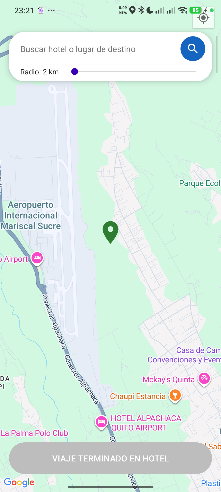
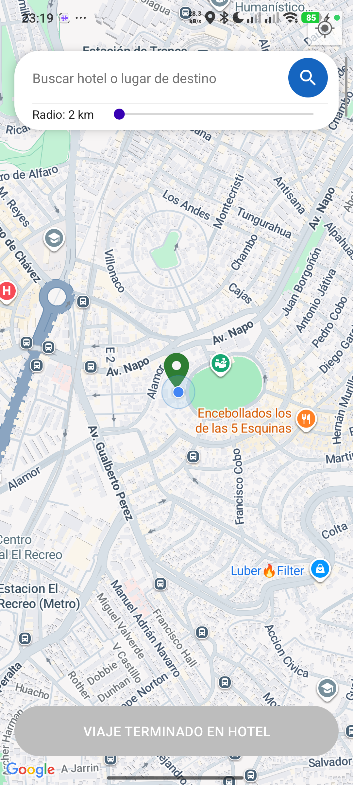
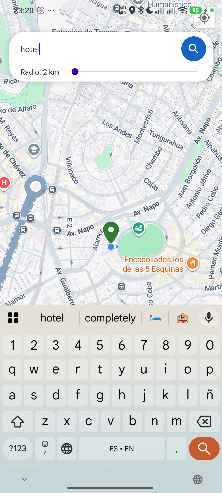
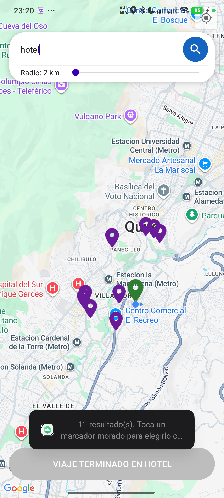
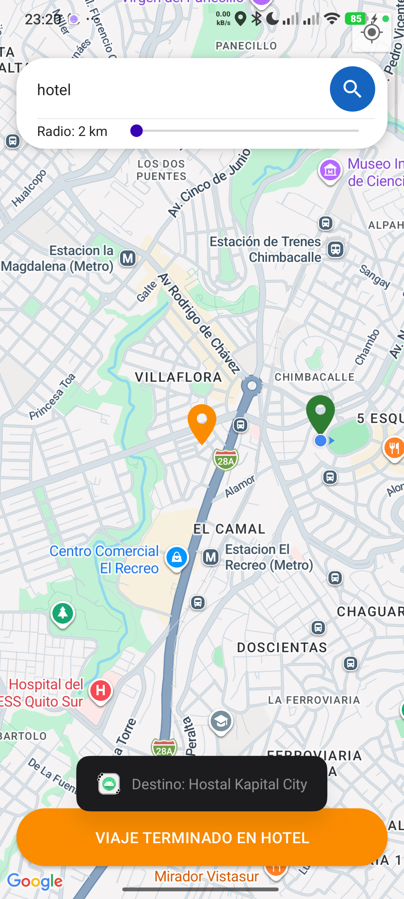
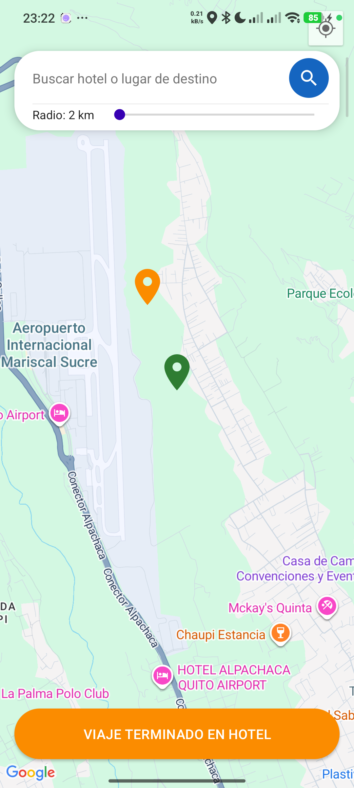
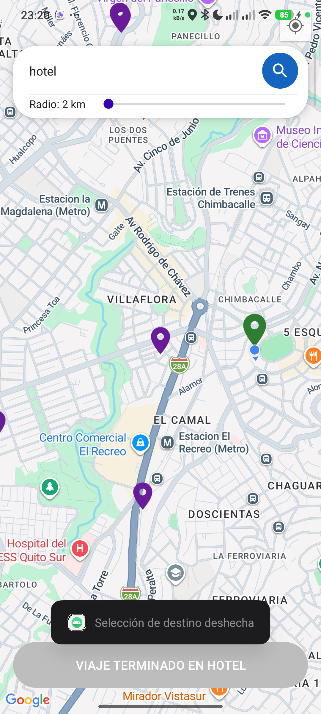

# Informe Final — CityDrive (Módulo de Transporte)
### Proyecto grupal: Ruta de Entretenimiento y Turismo Urbano

**Integrante:** Carol Velásquez
**Rol en el ecosistema:** App 2 — Transporte (recibe de AeroGate, envía a StaySmart)

---

## 1. Tema

Implementación de geolocalización con Google Maps SDK e interoperabilidad entre aplicaciones Android mediante Intents (deep links), aplicado al caso **CityDrive**, la aplicación de transporte dentro del ecosistema grupal *Ruta de Entretenimiento y Turismo Urbano*.

---

## 2. Objetivos

### 2.1 Objetivo general
Integrar el SDK de Google Maps en una aplicación Android nativa en Kotlin y comunicarla mediante Intents con las demás aplicaciones del ecosistema grupal, cumpliendo el rol de módulo de transporte entre el aeropuerto (AeroGate) y el hotel (StaySmart).

### 2.2 Objetivos específicos
- Configurar `MapsActivity` como punto de entrada de la aplicación (launcher), reemplazando el `<fragment>` clásico por `FragmentContainerView`.
- Recibir datos dinámicos (coordenadas, pasajero, categoría de vehículo) desde AeroGate mediante un Intent implícito (deep link) y representarlos con un marcador personalizado en el mapa.
- Implementar geolocalización real del dispositivo (GPS) con manejo de permisos en tiempo de ejecución.
- Permitir al pasajero elegir un destino de forma realista: buscando por nombre/categoría dentro de un radio configurable, o tocando el mapa directamente.
- Enviar los datos de la reserva de transporte (coordenadas de llegada, ID de reserva, ID de huésped) a StaySmart mediante un segundo Intent.
- Proteger la API Key de Google Maps para que no quede expuesta en el repositorio del proyecto.

---

## 3. Desarrollo

### 3.1 Arquitectura del ecosistema grupal

El proyecto grupal encadena 5 aplicaciones independientes mediante Intents con esquema de deep link personalizado:

```
AeroGate ──(citydrive://request_ride)──▶ CityDrive ──(staysmart://auto_checkin)──▶ StaySmart ──▶ ArenaTick ──▶ CityPulse
```

CityDrive ocupa la posición 2 de la cadena: es simultáneamente **receptor** (de AeroGate) y **emisor** (hacia StaySmart).

**Contrato de datos acordado con el equipo:**

| Dirección | Extra (key) | Tipo | Descripción |
|---|---|---|---|
| AeroGate → CityDrive | `PARAM_ORIGEN_LAT` / `PARAM_ORIGEN_LNG` | Double | Coordenadas de recogida (aeropuerto) |
| AeroGate → CityDrive | `PARAM_PASAJERO_NOMBRE` | String | Nombre del pasajero |
| AeroGate → CityDrive | `PARAM_CAT_VEHICULO` | String | Categoría de vehículo solicitada |
| AeroGate → CityDrive | `PARAM_ID_VUELO` | String | Identificador del vuelo |
| CityDrive → StaySmart | `PARAM_DESTINO_LAT` / `PARAM_DESTINO_LNG` | Double | Coordenadas de llegada (hotel elegido) |
| CityDrive → StaySmart | `PARAM_ID_RESERVA` | String | ID de la reserva de transporte, generado automáticamente |
| CityDrive → StaySmart | `PARAM_HUESPED_ID` | String | ID de huésped, generado automáticamente |
| CityDrive → StaySmart | `PARAM_TIMESTAMP_LLEGADA` | Long | Marca de tiempo de la llegada |

### 3.2 Configuración base del proyecto individual

`MapsActivity` se configuró como actividad *launcher* en el `AndroidManifest.xml`, y se agregó un segundo `intent-filter` para recibir el deep link de AeroGate:

```xml
<activity
    android:name=".MapsActivity"
    android:exported="true"
    android:theme="@style/Theme.CityDrive">
    <intent-filter>
        <action android:name="android.intent.action.MAIN" />
        <category android:name="android.intent.category.LAUNCHER" />
    </intent-filter>

    <!-- Deep link recibido desde AeroGate (App 1) -->
    <intent-filter>
        <action android:name="android.intent.action.VIEW" />
        <category android:name="android.intent.category.DEFAULT" />
        <category android:name="android.intent.category.BROWSABLE" />
        <data android:scheme="citydrive" android:host="request_ride" />
    </intent-filter>
</activity>
```

Dos detalles técnicos importantes que se validaron durante el desarrollo:
- `android:exported="true"` es obligatorio desde Android 12 (API 31) para cualquier actividad que reciba Intents de otra aplicación.
- La categoría `android.intent.category.DEFAULT` es indispensable: sin ella, un Intent implícito (como el que envía AeroGate) no puede resolver contra este `intent-filter`.

También se declaró un bloque `<queries>` para poder resolver el deep link de salida hacia StaySmart, requisito de visibilidad de paquetes desde Android 11 (API 30):

```xml
<queries>
    <intent>
        <action android:name="android.intent.action.VIEW" />
        <data android:scheme="staysmart" />
    </intent>
</queries>
```

En el layout (`activity_maps.xml`), se reemplazó el `<fragment>` clásico por `FragmentContainerView` (práctica recomendada actual) y se usó el tema `Theme.AppCompat.Light.NoActionBar`, compatible con `SupportMapFragment`.

### 3.3 Protección de la API Key

Inicialmente la clave de Google Maps quedó escrita directamente en el `AndroidManifest.xml`, lo que la expuso en el repositorio de GitHub. Se corrigió moviéndola a `local.properties` (archivo excluido de git) y usando el plugin `secrets-gradle-plugin`, que la inyecta en el Manifest en tiempo de compilación:

```xml
<meta-data
    android:name="com.google.android.geo.API_KEY"
    android:value="${MAPS_API_KEY}" />
```

Para poder usarla también desde el código Kotlin (necesario para las llamadas HTTP a Places API), se expuso como constante de `BuildConfig`:

```kotlin
// app/build.gradle.kts
buildConfigField("String", "MAPS_API_KEY", "\"${localProperties.getProperty("MAPS_API_KEY", "")}\"")
```

La clave anterior, ya expuesta en el historial de git, fue **regenerada** en Google Cloud Console y restringida por `applicationId` + huella SHA-1 del certificado de firma.

### 3.4 Recepción de datos desde AeroGate

```kotlin
private fun leerIntentDeAeroGate() {
    val data: Uri? = intent?.data
    if (intent?.action == Intent.ACTION_VIEW && data != null) {
        vinoDeAeroGate = true
        origenLat = intent.getDoubleExtra("PARAM_ORIGEN_LAT", origenLat)
        origenLng = intent.getDoubleExtra("PARAM_ORIGEN_LNG", origenLng)
        pasajeroNombre = intent.getStringExtra("PARAM_PASAJERO_NOMBRE") ?: pasajeroNombre
        categoriaVehiculo = intent.getStringExtra("PARAM_CAT_VEHICULO") ?: categoriaVehiculo
        idVuelo = intent.getStringExtra("PARAM_ID_VUELO") ?: idVuelo
    }
}
```

Se definieron valores por defecto para cada dato recibido, de forma que la aplicación pueda abrirse y probarse de forma aislada (sin depender de que AeroGate esté instalada) durante el desarrollo.

**Prueba con ADB simulando el Intent de AeroGate:**

```bash
adb shell am start -a android.intent.action.VIEW -d "citydrive://request_ride" \
  --ef PARAM_ORIGEN_LAT -0.1292 --ef PARAM_ORIGEN_LNG -78.3484 \
  --es PARAM_PASAJERO_NOMBRE Julian --es PARAM_CAT_VEHICULO VIP \
  --es PARAM_ID_VUELO AV-1234
```



*Figura 1. El marcador de recogida (verde) aparece exactamente en las coordenadas del Aeropuerto Mariscal Sucre enviadas por AeroGate, y el Toast confirma la recepción correcta de los datos del pasajero ("Buscando conductor VIP para Julian").*

### 3.5 Marcadores personalizados

Se diseñaron íconos vectoriales propios para cada tipo de marcador (en vez de los pines por defecto de Google Maps), convertidos a `BitmapDescriptor` mediante una función auxiliar:

```kotlin
private fun bitmapDescriptorFromVector(vectorResId: Int): BitmapDescriptor {
    val drawable = ContextCompat.getDrawable(this, vectorResId)!!
    drawable.setBounds(0, 0, drawable.intrinsicWidth, drawable.intrinsicHeight)
    val bitmap = Bitmap.createBitmap(drawable.intrinsicWidth, drawable.intrinsicHeight, Bitmap.Config.ARGB_8888)
    val canvas = Canvas(bitmap)
    drawable.draw(canvas)
    return BitmapDescriptorFactory.fromBitmap(bitmap)
}
```

Leyenda de colores usada en toda la aplicación:

| Color | Significado |
|---|---|
| 🟢 Verde | Punto de recogida / ubicación real del dispositivo |
| 🟠 Naranja | Destino elegido por el pasajero |
| 🟣 Morado | Resultados de una búsqueda (candidatos a destino) |

### 3.6 Geolocalización real del dispositivo

Se solicitan permisos de ubicación en tiempo de ejecución con `ActivityResultContracts`, y se activa la capa nativa de "mi ubicación" de Google Maps junto con una lectura GPS fresca mediante `FusedLocationProviderClient`:

```kotlin
@SuppressLint("MissingPermission")
private fun habilitarUbicacionEnMapa() {
    mMap.isMyLocationEnabled = true
    mMap.uiSettings.isMyLocationButtonEnabled = true

    fusedLocationClient.getCurrentLocation(
        Priority.PRIORITY_HIGH_ACCURACY,
        CancellationTokenSource().token
    ).addOnSuccessListener { location ->
        if (location != null) {
            ubicacionActual = LatLng(location.latitude, location.longitude)
            if (!vinoDeAeroGate) {
                // Si la app se abrió sola, el punto de recogida se centra en la ubicación real
                dibujarMarcadorRecogida(ubicacionActual!!)
            }
        }
    }
}
```



*Figura 2. Mapa abierto de forma independiente (sin Intent de AeroGate): el marcador verde se ubica en la posición GPS real del dispositivo, junto al punto azul nativo de "mi ubicación".*

### 3.7 Búsqueda de lugares cercanos (Places API)

Para permitir búsquedas por palabra clave ("hotel") dentro de un radio configurable por el usuario (2 a 50 km, mediante un `SeekBar`), se integró **Google Places API — Nearby Search**, ejecutada en un hilo de fondo con corrutinas de Kotlin:

```kotlin
private fun buscarLugaresEnPlacesApi(query: String, centro: LatLng, radioMetros: Int): List<LugarEncontrado> {
    val url = URL(
        "https://maps.googleapis.com/maps/api/place/nearbysearch/json" +
            "?location=${centro.latitude},${centro.longitude}" +
            "&radius=$radioMetros" +
            "&keyword=" + URLEncoder.encode(query, "UTF-8") +
            "&key=${BuildConfig.MAPS_API_KEY}"
    )
    // ... llamada HTTP + parseo JSON con HttpURLConnection y org.json
}
```

Un detalle técnico relevante encontrado durante las pruebas: inicialmente se usó el endpoint **Text Search**, cuyo parámetro `radius` solo actúa como una sugerencia de ranking (no como límite estricto), lo que producía resultados fuera del área esperada. Se migró a **Nearby Search**, donde `location` + `radius` sí delimitan estrictamente la búsqueda, y se usa `keyword` para el filtrado por texto libre.

La búsqueda se centra en la ubicación GPS real del dispositivo (`ubicacionActual`), con la ubicación de recogida como respaldo si aún no hay lectura GPS disponible.



*Figura 3. Barra de búsqueda con el radio configurado en 2 km mediante el slider.*



*Figura 4. Resultados de "hotel" (pines morados) agrupados dentro del radio de 2 km alrededor de la ubicación real (pin verde), con el conteo de resultados mostrado por Toast.*

### 3.8 Selección de destino y experiencia de usuario

El pasajero puede elegir su destino de dos formas: tocando uno de los marcadores morados de búsqueda, o tocando el mapa libremente.

```kotlin
mMap.setOnMarkerClickListener { marker ->
    if (resultadosMarkers.contains(marker)) {
        seleccionarComoDestino(marker)
        true
    } else {
        false
    }
}
```



*Figura 5. Al tocar un resultado, este se convierte en el destino (pin naranja), se limpian los demás candidatos y se habilita el botón "Viaje Terminado en Hotel".*



*Figura 6. El pasajero también puede fijar un destino tocando cualquier punto del mapa directamente, sin pasar por la búsqueda.*

**Manejo del botón "Atrás":** dado que `MapsActivity` es la única actividad de la aplicación, presionar "Atrás" cerraba la app incluso cuando el usuario quería corregir una selección. Se implementó un `OnBackPressedCallback` que solo se activa cuando hay un destino elegido, y que en ese caso deshace la selección y restaura los resultados de la última búsqueda en vez de salir de la aplicación:

```kotlin
private val deshacerDestinoCallback = object : OnBackPressedCallback(false) {
    override fun handleOnBackPressed() {
        deshacerSeleccionDeDestino()
    }
}
```



*Figura 7. Tras presionar "Atrás" con un destino elegido por error, se restauran los pines morados de la última búsqueda y el botón vuelve a su estado deshabilitado.*

### 3.9 Envío de datos a StaySmart

Al confirmar el destino, CityDrive genera automáticamente el ID de reserva y el ID de huésped (el pasajero no los conoce ni los ingresa manualmente, tal como ocurriría en una aplicación real de transporte), y los envía junto con las coordenadas mediante un Intent explícito por deep link:

```kotlin
private fun enviarAStaySmart() {
    val destino = destinoSeleccionado ?: return
    val idReserva = "CD-" + UUID.randomUUID().toString().take(8).uppercase()
    val huespedId = "USR-" + pasajeroNombre.hashCode().toString().takeLast(6)

    val intent = Intent(Intent.ACTION_VIEW).apply {
        data = Uri.parse("staysmart://auto_checkin")
        putExtra("PARAM_ID_RESERVA", idReserva)
        putExtra("PARAM_DESTINO_LAT", destino.latitude)
        putExtra("PARAM_DESTINO_LNG", destino.longitude)
        putExtra("PARAM_HUESPED_ID", huespedId)
        putExtra("PARAM_TIMESTAMP_LLEGADA", System.currentTimeMillis())
    }

    if (intent.resolveActivity(packageManager) != null) {
        startActivity(intent)
    } else {
        Toast.makeText(this, "Por favor, instala la app StaySmart", Toast.LENGTH_LONG).show()
    }
}
```

Se valida con `resolveActivity()` antes de lanzar el Intent, mostrando un mensaje claro si StaySmart no está instalada en el dispositivo — comportamiento verificado durante las pruebas, ya que StaySmart (desarrollada por otra integrante del equipo) aún no estaba disponible para instalar en el mismo dispositivo al momento de estas pruebas.

---

## 4. Pruebas realizadas

| Prueba | Resultado |
|---|---|
| Apertura directa de la app (sin Intent) | ✅ Centra el mapa en la ubicación GPS real del dispositivo |
| Recepción de Intent simulado desde AeroGate (vía ADB) | ✅ Marcador dinámico en las coordenadas recibidas, datos del pasajero mostrados correctamente |
| Búsqueda de "hotel" con radio de 2 km | ✅ Resultados contenidos dentro del radio, centrados en la ubicación real |
| Selección de destino desde resultados de búsqueda | ✅ Marcador naranja, botón habilitado |
| Selección de destino tocando el mapa | ✅ Funciona igual que desde búsqueda |
| Deshacer selección con botón "Atrás" | ✅ Restaura resultados de búsqueda anteriores en vez de cerrar la app |
| Envío a StaySmart sin la app instalada | ✅ Mensaje de aviso en vez de crash |
| Denegación de permiso de ubicación | ✅ La app sigue funcionando con el punto de recogida por defecto |
| Envío a StaySmart con la app instalada | ⏳ Pendiente — depende de que la integrante responsable de StaySmart complete su parte del contrato de Intents |

---

## 5. Conclusiones

- El uso de `FragmentContainerView` en lugar de `<fragment>` y de un tema `AppCompat` compatible con `SupportMapFragment` permitió una integración estable del mapa sin necesidad de Jetpack Compose para esta pantalla.
- Los Intents implícitos con esquema de deep link personalizado (`citydrive://`, `staysmart://`) resultaron una forma efectiva y desacoplada de comunicar aplicaciones independientes desarrolladas por distintos integrantes del equipo, siempre que se coordine con precisión el nombre y tipo de cada extra.
- Dos requisitos de plataforma fáciles de pasar por alto, pero indispensables para que la comunicación entre apps funcione en dispositivos con Android 11+, fueron: la categoría `DEFAULT` en el `intent-filter` receptor y el bloque `<queries>` en el emisor.
- Elegir el endpoint correcto de una API externa importa tanto como implementarla: Text Search y Nearby Search de Google Places tienen semánticas de radio distintas, y usar la incorrecta produjo resultados geográficamente inconsistentes pese a que el código "funcionaba" sin errores.
- Proteger credenciales (API keys) desde el inicio del desarrollo, en vez de al final, evita exponerlas en el historial de control de versiones de un repositorio compartido por el equipo.

---

## 6. Referencias (Formato IEEE)

[1] Google, "Add a map with a marker," *Android Developers*, 2025. [Online]. Available: https://developer.android.com/develop/ui/views/layout/... [Accessed: Jul. 23, 2026].

[2] Google, "Maps SDK for Android overview," *Google for Developers*, 2025. [Online]. Available: https://developers.google.com/maps/documentation/android-sdk/overview [Accessed: Jul. 23, 2026].

[3] Google, "Intents and intent filters," *Android Developers*, 2025. [Online]. Available: https://developer.android.com/guide/components/intents-filters [Accessed: Jul. 23, 2026].

[4] Google, "Request runtime permissions," *Android Developers*, 2025. [Online]. Available: https://developer.android.com/training/permissions/requesting [Accessed: Jul. 23, 2026].

[5] Google, "Nearby Search (Legacy)," *Google for Developers — Places API*, 2025. [Online]. Available: https://developers.google.com/maps/documentation/places/web-service/search-nearby [Accessed: Jul. 23, 2026].

[6] Google, "Get the current location," *Android Developers*, 2025. [Online]. Available: https://developer.android.com/develop/sensors-and-location/location/retrieve-current [Accessed: Jul. 23, 2026].

[7] Google, "Handle the back button," *Android Developers*, 2025. [Online]. Available: https://developer.android.com/guide/navigation/custom-back/predictive-back-gesture [Accessed: Jul. 23, 2026].

*(Ajustar la fecha de "Accessed" a la fecha real en que cada referencia fue consultada.)*
